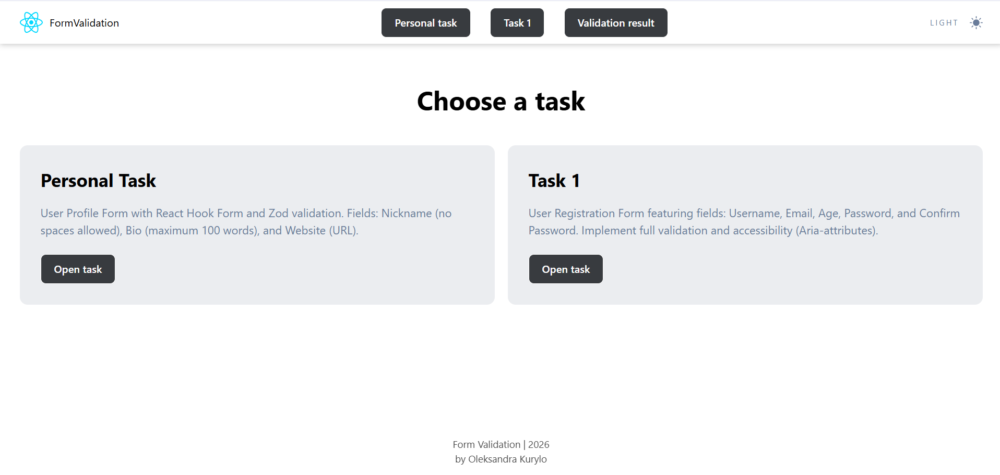
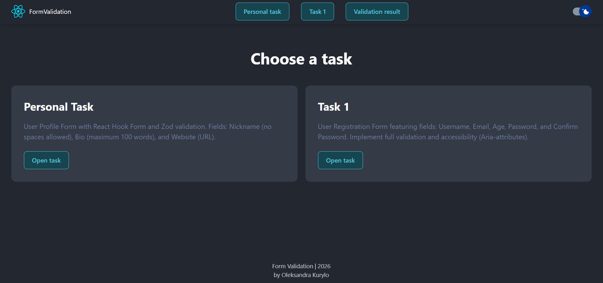
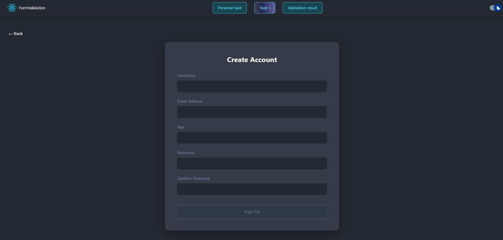
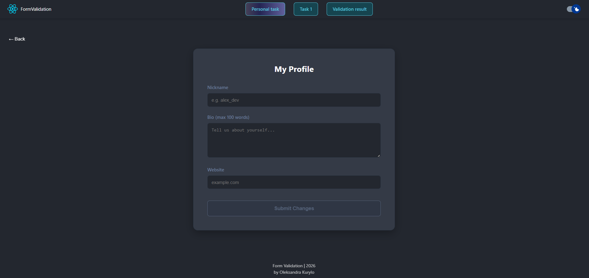
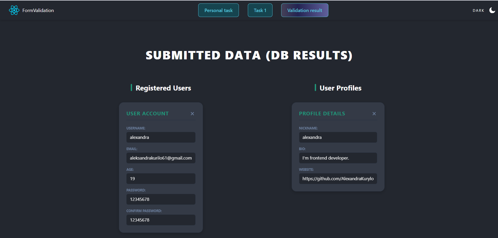
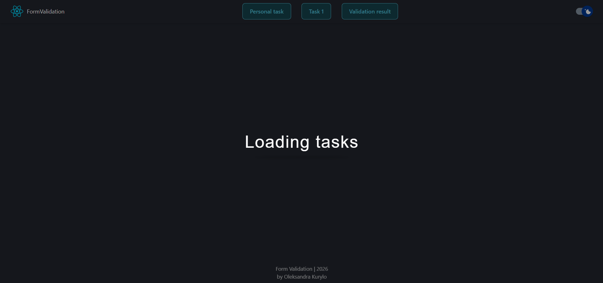
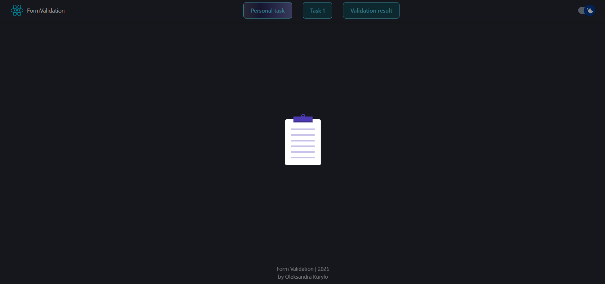

## Advanced Validation with React Hook Form & Zod

### 🏞️ Project Previews

<p align="center">
   
   
   
   
   
   
   
</p>

🔗 [Live Demo](https://form-validation-mfpe.onrender.com)

### 📝 Project Features

- Full CRUD Implementation: Complete data management cycle (Create, Read, and Delete) interacting with a Mock REST API.

- React Form Management: Robust form handling using React Hook Form for optimal performance and minimal re-renders.

- Schema-based Validation: Comprehensive client-side validation and type safety powered by Zod.

- Advanced Data Fetching: Centralized API logic with custom hooks handling loading states, error boundaries, and artificial delays for better UX.

- Web Accessibility (A11y): Accessible forms with ARIA attributes, semantic HTML, and proper focus management for screen readers.

### 🛠 Tech Stack

- Frontend: React (Hooks, Context)

- Language: TypeScript (Generics, Strict Typing)

- Backend (Mock): JSON Server (REST API simulation)

- Routing: React Router v6.4 (Dynamic routing)

- Forms & Validation: React Hook Form, Zod

- Styling: CSS Modules (BEM methodology, Responsive design)

### 🗝️ Key Implementations

#### 1. User Profile Form (Individual Task)

- A personalized profile management form featuring:

- Nickname: Validated to ensure no spaces are allowed.

- Biography: Limited to a maximum of 100 words.

- Website: URL validation with automated protocol checks.

- Validation: Powered by a unified Zod schema and React Hook Form.

#### 2. User Registration Form

- A complete registration flow including the following fields:

- Full Name, Email, and Age.

- Password & Confirm Password: Includes cross-field validation to ensure passwords match.

- A11y & Validation: Fully accessible inputs with real-time error feedback for an enhanced user experience.

#### 3. Database Dashboard (CRUD Results Page)

- Generic Data Cards: A highly reusable DataCard component built with TypeScript Generics to display any data structure from the DB.

- Real-time Interaction: Integrated DELETE operations that instantly update the UI without page reloads.

- Unified Fetching: Using Promise.all to fetch data from multiple endpoints (Users & Profiles) simultaneously.

#### 4. Custom Hooks & Logic

- useFetch: A complex custom hook that encapsulates try/catch logic, isLoading states, and error handling for all API calls.

- useDelayedLoader: An artificial delay hook using a Promise-based helper to ensure smooth transitions and visibility of the loading states.

- delayFn: A utility helper to simulate real-world network latency.

#### 5. Forms & Validation

- Registration & Profile Forms: Featuring cross-field validation (e.g., password matching), URL protocol checks, and word-count limits.

- Automatic Data Persistence: Successful form submissions trigger POST requests to the JSON Server to save user data.

### 📂 Folder Structure

```text
src/
├── assets/                   # Static media (icons, previews, favicons)
│   ├── icon-moon.svg
│   ├── icon-sun.svg
│   ├── preview.png
│   └── ...
├── components/               # Reusable UI components
│   ├── Button/               # Generic button component
│   ├── DataCard/             # Dashboard card (Generic CRUD component)
│   ├── Header/               # Site navigation and theme toggle
│   ├── Loader/               # Animated loading spinner/text
│   ├── MainLayout/           # Shared page wrapper
│   ├── RegisterForm/         # Registration logic & Zod schema
│   │   ├── RegisterForm.tsx
│   │   ├── RegisterForm.module.css
│   │   ├── registerSchema.ts
│   │   └── index.ts
│   ├── TaskCard/             # Component for task display
│   ├── ThemeSwitcher/        # Dark/Light mode toggle
│   └── UserProfileForm/      # Profile management logic & schema
│       ├── UserProfileForm.tsx
│       ├── UserProfileForm.module.css
│       ├── profilesSchema.ts
│       └── index.ts
├── constants/                # Global configuration strings
│   └── global.constants.ts   # API_URL
├── helpers/                  # Pure utility functions
│   └── delayFn.ts            # Custom delay for loader simulation
├── hooks/                    # Custom React hooks
│   ├── useFetch.ts           # Centralized API handling (Loading/Error)
│   └── useDelayedLoader.ts   # Hook for artificial page delays
├── pages/                    # Top-level route components
│   ├── HomePage/             # Portfolio/Intro page
│   ├── NotFoundPage/         # 404 Error handling
│   ├── RegisterFormPage/     # Registration route
│   ├── UserProfileFormPage/  # Profile route
│   └── ValidationResultPage/ # CRUD Dashboard (Database results)
├── App.tsx                   # Routing
├── index.css                 # Global resets & variable definitions
└── main.tsx                  # Application entry point
```

### How to run a project locally

Open a terminal and run the command:

#### 1. Cloning a repository

```bash
git clone [https://github.com/AlexandraKurylo/form-validation.git](https://github.com/AlexandraKurylo/form-validation.git)
```

#### 2. Installing dependencies

```bash
   npm install
```

#### 3. Starting the database (Terminal 1)

```bash
   npm run server
```

#### 4. Launching the application (Terminal 2)

```bash
   npm run dev
```

#### 5. You can run the database and application with one command in one terminal

```bash
   npm run start:app
```
